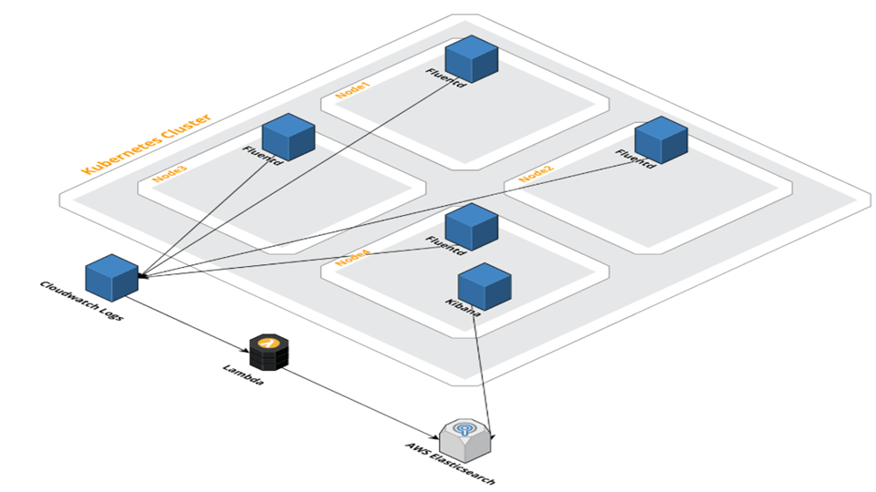

# terraform-k8s-logging-cw

Terraform module to provide shipping logs from EKS cluster via CloudWatch to AWS Elasticsearch. 
Inspired by [Chalitha Jayanath](https://medium.com/@chalitha4u/steps-to-deploy-efk-elasticsearch-fluentd-and-kibana-to-aws-kubernetes-cluster-998fa8ceee68). 

CloudWatch Logs can be delivered to other services such as Amazon Elasticsearch for custom processing.

This module does that. More info <a href="https://eksworkshop.com/intermediate/230_logging/configurecwl/">here</a> and
<a href="https://medium.com/@chalitha4u/steps-to-deploy-efk-elasticsearch-fluentd-and-kibana-to-aws-kubernetes-cluster-998fa8ceee68">here</a>.


> (2018). Retrieved from https://medium.com/@chalitha4u/steps-to-deploy-efk-elasticsearch-fluentd-and-kibana-to-aws-kubernetes-cluster-998fa8ceee68

## Usage

```hcl
module "terraform-k8s-logging-cw " {
  source = "git::ssh://git@github.com:gaarm/terraform-k8s-logging.git?ref=tags/1.0.0"
}
```